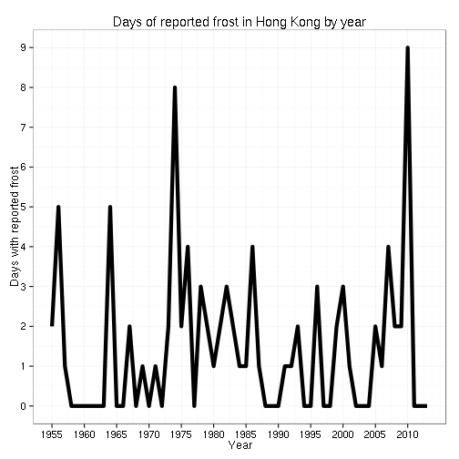

Frost in Hong Kong
========================================================


Hong Kong learnt from the British to be fascinated by the weather, or at least that it's safe and encouraged to be so. The weather is, of course, rather warmer and more stable than the old mother country, which makes discussion about it at the bus stop limited to complaining about humidity most of the year round.

However, excitement sets in around December time, when the weather actually becomes appreciably colder. As soon as the temperature hits 14°C (around 57°F for those who boil blood instead of water) the majestic Hong Kong Observatory announces, chest puffed out and up with self-appointed importance, that a ["Cold Weather Warning"](http://www.hko.gov.hk/wservice/warning/coldhot.htm) is in place. At such an extreme temperature, the Observatory intones over every available communication channel, that "If you must go out, avoid prolonged exposure to wintry winds", and other concerned bromides. Most of the populace duly follows by wearing at least three layers, with those of European extraction bucking the fashion and continuing to wear T-shirts and shorts, flaunting their hairiness and giggling over the locals' overly sensible nature. They then catch colds, at best.

The aforementioned majestic Hong Kong Observatory titillates the hibernating population with stories of **frost**. It presents, ostensibly in a sensible fashion, [historical records of how many days in previous years Hong Kong experienced this extreme weather condition](http://www.hko.gov.hk/cis/statistic/frost_statistic_e.htm). (There are also tales of something called **snow**, but no-one really believes them). I've taken the data and drawn better graphs than those provided by the regal HKO. Feel free to suggest how I could improve them further or make other ones with this data.


```r
frost <- fread(input = "frost.tsv", header = TRUE)
frost[, `:=`(Ann, NULL)]
```

```
##     Year Jan Feb Mar Apr May Jun Jul Aug Sep Oct Nov Dec
##  1: 1955   2   0   0   0   0   0   0   0   0   0   0   0
##  2: 1956   5   0   0   0   0   0   0   0   0   0   0   0
##  3: 1957   0   1   0   0   0   0   0   0   0   0   0   0
##  4: 1958   0   0   0   0   0   0   0   0   0   0   0   0
##  5: 1959   0   0   0   0   0   0   0   0   0   0   0   0
##  6: 1960   0   0   0   0   0   0   0   0   0   0   0   0
##  7: 1961   0   0   0   0   0   0   0   0   0   0   0   0
##  8: 1962   0   0   0   0   0   0   0   0   0   0   0   0
##  9: 1963   0   0   0   0   0   0   0   0   0   0   0   0
## 10: 1964   4   1   0   0   0   0   0   0   0   0   0   0
## 11: 1965   0   0   0   0   0   0   0   0   0   0   0   0
## 12: 1966   0   0   0   0   0   0   0   0   0   0   0   0
## 13: 1967   2   0   0   0   0   0   0   0   0   0   0   0
## 14: 1968   0   0   0   0   0   0   0   0   0   0   0   0
## 15: 1969   0   1   0   0   0   0   0   0   0   0   0   0
## 16: 1970   0   0   0   0   0   0   0   0   0   0   0   0
## 17: 1971   1   0   0   0   0   0   0   0   0   0   0   0
## 18: 1972   0   0   0   0   0   0   0   0   0   0   0   0
## 19: 1973   0   0   0   0   0   0   0   0   0   0   0   2
## 20: 1974   4   4   0   0   0   0   0   0   0   0   0   0
## 21: 1975   0   0   0   0   0   0   0   0   0   0   0   2
## 22: 1976   2   0   0   0   0   0   0   0   0   0   0   2
## 23: 1977   0   0   0   0   0   0   0   0   0   0   0   0
## 24: 1978   3   0   0   0   0   0   0   0   0   0   0   0
## 25: 1979   1   1   0   0   0   0   0   0   0   0   0   0
## 26: 1980   1   0   0   0   0   0   0   0   0   0   0   0
## 27: 1981   0   0   0   0   0   0   0   0   0   0   0   2
## 28: 1982   0   0   0   0   0   0   0   0   0   0   0   3
## 29: 1983   1   0   0   0   0   0   0   0   0   0   0   1
## 30: 1984   0   1   0   0   0   0   0   0   0   0   0   0
## 31: 1985   0   0   0   0   0   0   0   0   0   0   0   1
## 32: 1986   2   0   2   0   0   0   0   0   0   0   0   0
## 33: 1987   0   0   0   0   0   0   0   0   0   0   1   0
## 34: 1988   0   0   0   0   0   0   0   0   0   0   0   0
## 35: 1989   0   0   0   0   0   0   0   0   0   0   0   0
## 36: 1990   0   0   0   0   0   0   0   0   0   0   0   0
## 37: 1991   0   0   0   0   0   0   0   0   0   0   0   1
## 38: 1992   1   0   0   0   0   0   0   0   0   0   0   0
## 39: 1993   2   0   0   0   0   0   0   0   0   0   0   0
## 40: 1994   0   0   0   0   0   0   0   0   0   0   0   0
## 41: 1995   0   0   0   0   0   0   0   0   0   0   0   0
## 42: 1996   0   3   0   0   0   0   0   0   0   0   0   0
## 43: 1997   0   0   0   0   0   0   0   0   0   0   0   0
## 44: 1998   0   0   0   0   0   0   0   0   0   0   0   0
## 45: 1999   0   0   0   0   0   0   0   0   0   0   0   2
## 46: 2000   2   1   0   0   0   0   0   0   0   0   0   0
## 47: 2001   0   0   0   0   0   0   0   0   0   0   0   1
## 48: 2002   0   0   0   0   0   0   0   0   0   0   0   0
## 49: 2003   0   0   0   0   0   0   0   0   0   0   0   0
## 50: 2004   0   0   0   0   0   0   0   0   0   0   0   0
## 51: 2005   0   0   1   0   0   0   0   0   0   0   0   1
## 52: 2006   0   0   0   0   0   0   0   0   0   0   0   1
## 53: 2007   4   0   0   0   0   0   0   0   0   0   0   0
## 54: 2008   2   0   0   0   0   0   0   0   0   0   0   0
## 55: 2009   2   0   0   0   0   0   0   0   0   0   0   0
## 56: 2010   1   2   1   0   0   0   0   0   0   0   0   5
## 57: 2011   0   0   0   0   0   0   0   0   0   0   0   0
## 58: 2012   0   0   0   0   0   0   0   0   0   0   0   0
## 59: 2013   0   0   0   0   0   0   0   0   0   0   0   0
##     Year Jan Feb Mar Apr May Jun Jul Aug Sep Oct Nov Dec
```

```r
frost <- data.table(melt(frost, id.vars = "Year"), key = "Year,variable")
setnames(frost, c("year", "month", "frost"))
frostbyyear <- frost[, list(frost = sum(frost)), by = year]
frostbyyearplot <- ggplot(frostbyyear) + geom_line(aes(x = year, y = frost), 
    size = 2) + labs(x = "Year", y = "Days with reported frost", title = "Days of reported frost in Hong Kong by year")
plot(frostbyyearplot)
```

 


```r
frostbymonth <- frost[, list(frost = sum(frost)), by = month]
frostbymonthplot <- ggplot(frostbymonth) + geom_line(aes(x = month, y = frost, 
    group = 1)) + theme_bw() + labs(x = "Month", y = "Days with reported frost", 
    title = "Days of reported frost in Hong Kong by month")
plot(frostbymonthplot)
```

 


```r
frostbymonthperyear <- frost[, list(frost = mean(frost)), by = month]
frostbymonthperyearplot <- ggplot(frostbymonthperyear) + geom_line(aes(x = month, 
    y = frost, group = 1)) + theme_bw() + labs(x = "Month", y = "Mean with reported frost", 
    title = "Mean days of reported frost in Hong Kong by month")
plot(frostbymonthperyearplot)
```

 


